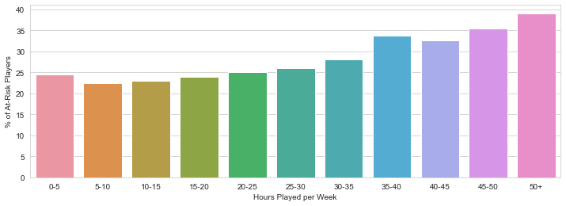
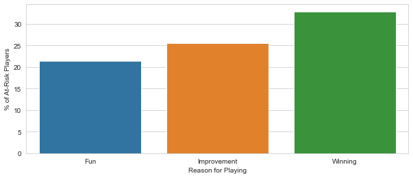
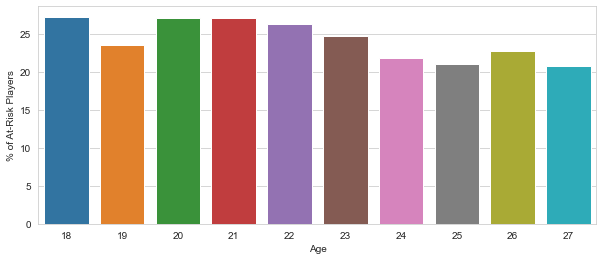
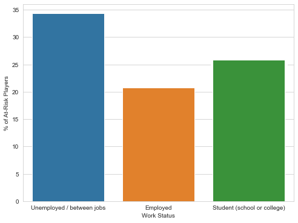
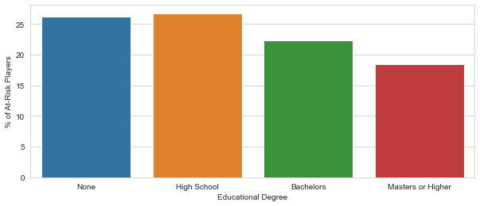
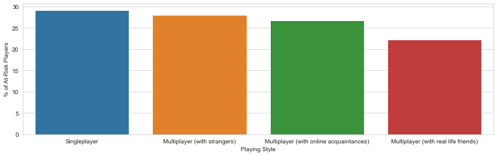

# Predicting at-risk gamers using their bio/social profiles
This model aims to predict gamers more likely to develop negative emotions such as anxiety, restleness, irritability and so on, using their bio and social profiles.

The data was collected as part of a study by Marian Sauter and Dejan Draschkow and is available for public download <a href="https://osf.io/vnbxk/">here</a>. The sample size of participants was ~13000. 

An exploratory data analysis revealed some clear correlations between negative feelings and a few of the data points :

1. Number of hours played :

2. Reason for playing :

3. Age group :

4. Employment Status :

5. Education :

6. Playing Environment :

